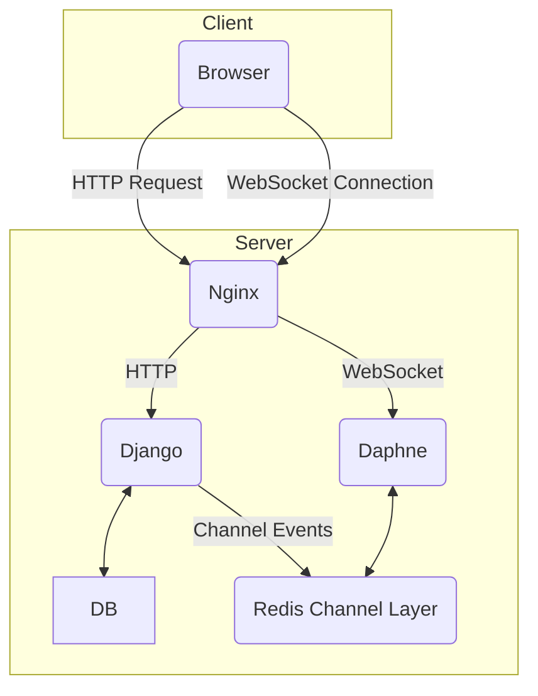

# ft_transcendence

```mermaid
graph TD
    subgraph Client
        B(Browser)
    end

    subgraph Server
        N(Nginx)
        D(Django)
        DA(Daphne)
        P(PostgreSQL)
        R(Redis Channel Layer)
    end

    B -- HTTP Request --> N
    B -- WebSocket Connection --> N
    
    N -- HTTP --> D
    N -- WebSocket --> DA

    D <--> P[DB]
    DA <--> R
    D -- Channel Events --> R
```
