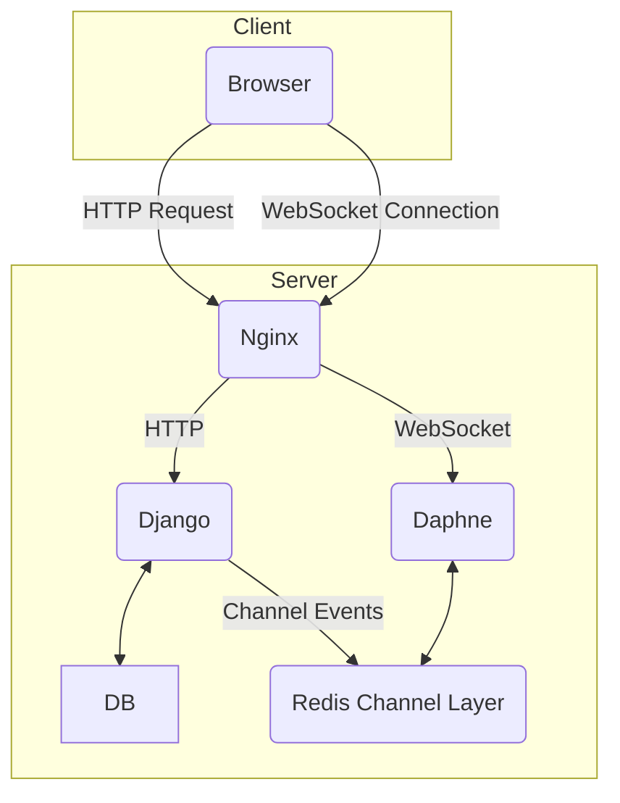
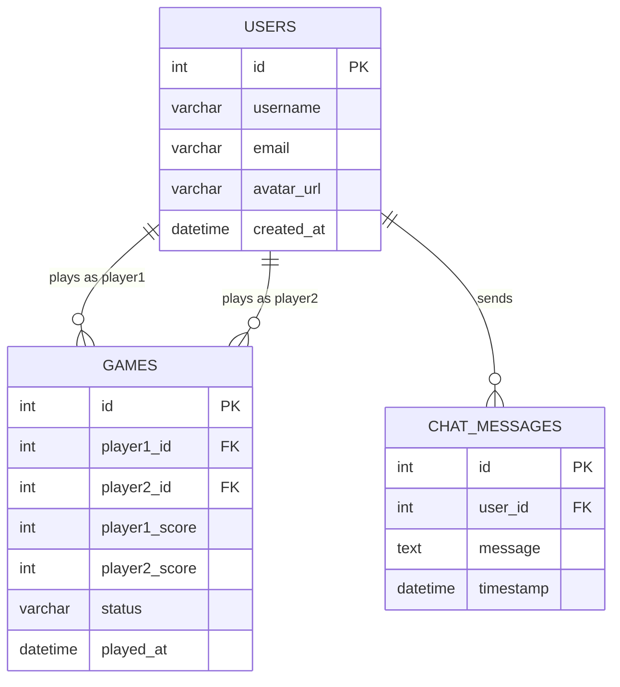

# ft_transcendence

## 개요
실시간 멀티플레이어 PONG 게임: WebSocket을 통해 두 명의 플레이어가 실시간으로 PONG 게임을 즐길 수 있습니다.
사용자 인증: 42 API를 이용한 OAuth 2.0 인증을 지원합니다.
채팅 기능: 사용자들이 실시간으로 메시지를 주고받을 수 있는 채팅 시스템이 구현되어 있습니다.
사용자 프로필 및 전적: 개인 프로필을 설정하고 다른 사용자의 정보를 조회할 수 있으며, 게임 전적을 확인하고 리더보드를 볼 수 있습니다.

## 기술 스택
백엔드: Python, Django, Django Channels
프론트엔드: JavaScript, HTML5, CSS
데이터베이스: PostgreSQL
인프라: Docker, Nginx

아래 다이어그램은 ft_transcendence 프로젝트의 전체적인 아키텍처를 보여줍니다. Nginx가 웹 서버 역할을 하며, HTTP 요청은 Django로, WebSocket 연결은 Daphne 서버로 전달됩니다.

ft_transcendence의 데이터베이스는 사용자, 게임, 채팅 메시지를 중심으로 설계되었습니다. 각 테이블의 관계는 아래 ER 다이어그램과 같습니다.

## 웹소켓 통신
실시간 게임과 채팅 기능은 Django Channels를 기반으로 한 WebSocket을 통해 구현되었습니다. 클라이언트와 서버는 JSON 형식의 메시지를 주고받으며, 게임 상태 업데이트, 채팅 메시지 전송 등의 이벤트 기반 통신이 이루어집니다.
주요 WebSocket 이벤트:
game.start: 게임 시작 요청
game.move: 플레이어의 움직임 정보 전송
game.state: 서버에서 클라이언트로 게임 상태 업데이트
chat.message: 새로운 채팅 메시지 전송 및 수신
