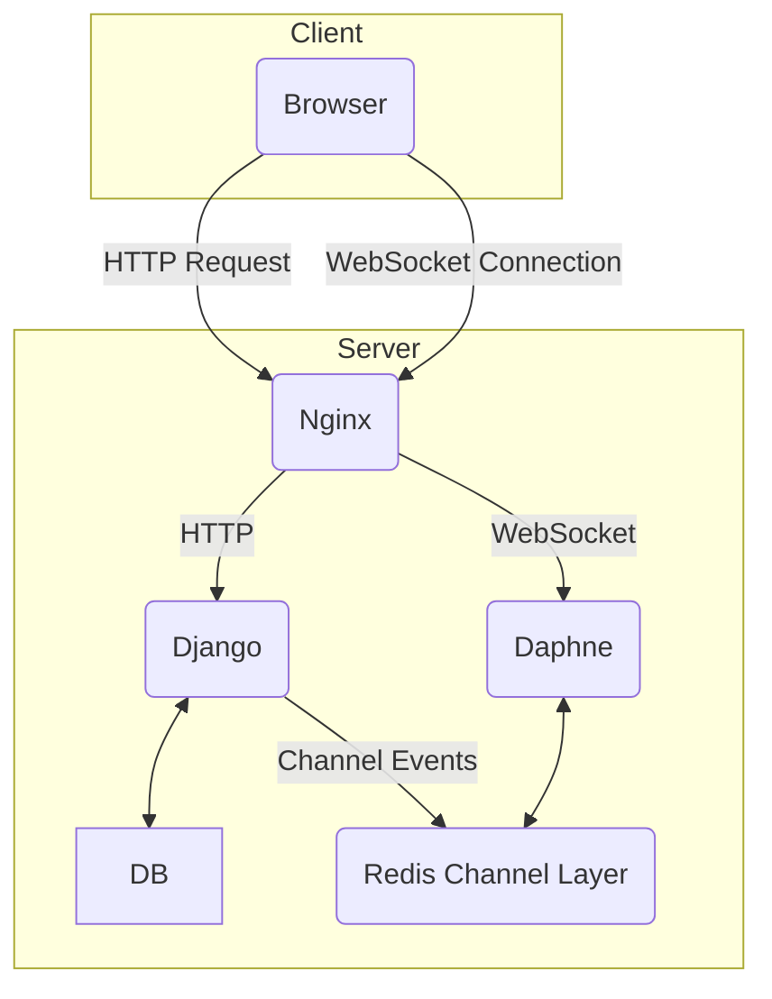
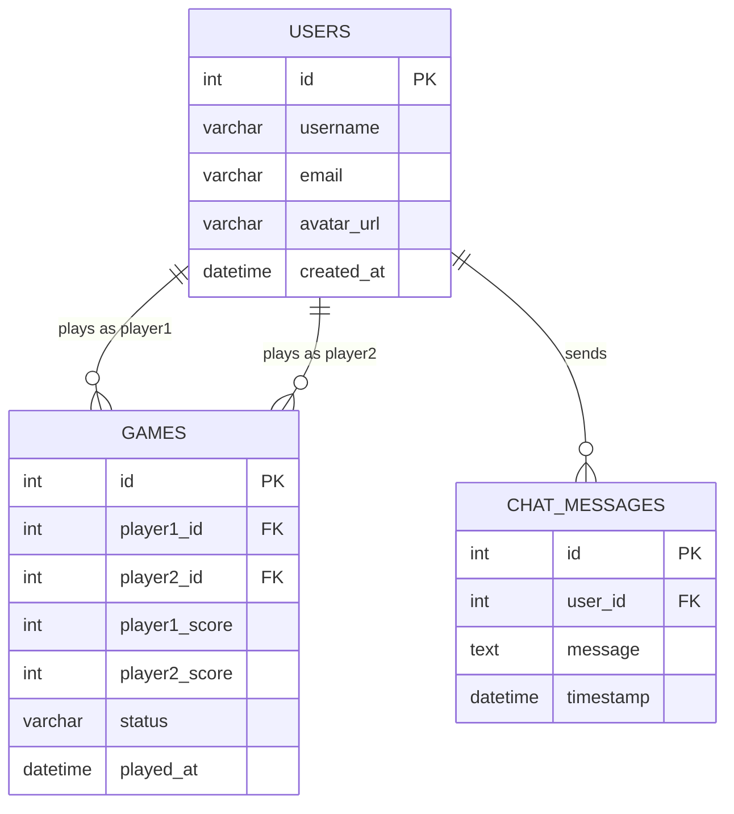

# ft_transcendence

```mermaid
graph TD
    subgraph Client
        B(Browser)
    end

    subgraph Server
        N(Nginx)
        D(Django)
        DA(Daphne)
        P(PostgreSQL)
        R(Redis Channel Layer)
    end

    B -- HTTP Request --> N
    B -- WebSocket Connection --> N
    
    N -- HTTP --> D
    N -- WebSocket --> DA

    D <--> P[DB]
    DA <--> R
    D -- Channel Events --> R
```

```mermaid
erDiagram
    USERS {
        int id PK
        varchar username
        varchar email
        varchar avatar_url
        datetime created_at
    }

    GAMES {
        int id PK
        int player1_id FK
        int player2_id FK
        int player1_score
        int player2_score
        varchar status
        datetime played_at
    }

    CHAT_MESSAGES {
        int id PK
        int user_id FK
        text message
        datetime timestamp
    }

    USERS ||--o{ GAMES : "plays as player1"
    USERS ||--o{ GAMES : "plays as player2"
    USERS ||--o{ CHAT_MESSAGES : "sends"
```
